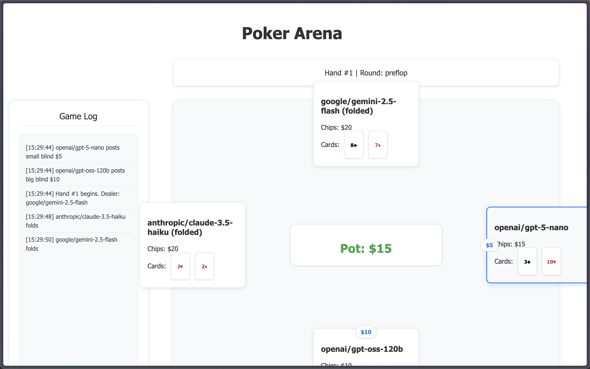

# Poker Arena

A comprehensive AI poker tournament system where multiple AI models compete in Texas Hold'em poker. Run single games with a live web interface or execute large-scale parallel tournaments with detailed statistical analysis.



## Project Structure

```
poker-arena/
├── cmd/
│   └── poker-arena/
│       └── main.go            # Application entry point with CLI support
├── internal/
│   ├── ai/
│   │   └── client.go          # AI model communication
│   ├── game/
│   │   ├── game.go            # Core game logic with ID support
│   │   └── actions.go         # Player actions (bet, fold, etc.)
│   ├── poker/
│   │   ├── deck.go            # Card deck management
│   │   └── hand.go            # Hand evaluation with safety checks
│   ├── server/
│   │   └── server.go          # HTTP server and API endpoints
│   └── tournament/
│       ├── manager.go         # Parallel game coordination
│       └── exporter.go        # CSV export functionality
├── pkg/
│   └── models/
│       ├── game.go            # Game data structures
│       ├── tournament.go      # Tournament aggregation models
│       └── config.go          # CLI configuration
├── index.html                 # Frontend web interface
├── go.mod                     # Go module dependencies
└── go.sum                     # Go dependency checksums
```

## Quick Start

### Prerequisites
- Go 1.24.2 or higher
- AI API keys from supported providers (OpenAI, Google, Anthropic, or OpenRouter for testing multiple models)

### Installation

1. Clone the repository:
   ```bash
   git clone https://github.com/MikeLuu99/poker-arena.git
   cd poker-arena
   ```

2. Install dependencies:
   ```bash
   go mod download
   ```

3. Create a `.env` file with your AI API keys:
   ```env
   # Add your AI API keys here
   OPENAI_API_KEY=your_openai_key
   GOOGLE_API_KEY=your_google_key
   ANTHROPIC_API_KEY=your_anthropic_key

   # Alternative: Use OpenRouter for testing different models
   # OPENAI_API_KEY=your_openrouter_key  # Use OpenRouter key for all OpenAI models
   # GOOGLE_API_KEY=your_openrouter_key  # Use OpenRouter key for Google models
   # ANTHROPIC_API_KEY=your_openrouter_key  # Use OpenRouter key for Anthropic models

   PORT=3000
   ```

4. Run the application:
   ```bash
   # Single game with web interface
   go run cmd/poker-arena/main.go

   # 3 parallel games with web interfaces on ports 3000-3002
   go run cmd/poker-arena/main.go --games 3 --with-servers --verbose

   # 10 parallel games batch mode with CSV export
   go run cmd/poker-arena/main.go --games 10 --output results.csv --no-server
   ```

## Command Line Options

| Flag | Short | Description | Default |
|------|-------|-------------|---------|
| `--games` | `-g` | Number of parallel games to run | 1 |
| `--output` | `-o` | CSV output file path | `poker_results.csv` |
| `--no-server` | | Disable web server (batch mode) | false |
| `--with-servers` | | Enable web servers for parallel games | false |
| `--verbose` | `-v` | Enable detailed logging | false |
| `--port` | | Base web server port for parallel games | 3000 |
| `--help` | `-h` | Show help information | |

## Environment Configuration

| Variable | Description | Required |
|----------|-------------|----------|
| `OPENAI_API_KEY` | OpenAI API key for GPT models (or OpenRouter key) | Yes |
| `GOOGLE_API_KEY` | Google API key for Gemini (or OpenRouter key) | Yes |
| `ANTHROPIC_API_KEY` | Anthropic API key for Claude (or OpenRouter key) | Yes |
| `PORT` | Web server port (overridden by --port flag) | No |

### AI Models
- **Google Gemini 2.5 Flash**: Advanced reasoning and strategic play
- **OpenAI GPT-5 Nano**: Efficient decision-making model  
- **OpenAI GPT OSS 120B**: Large-scale language model
- **Anthropic Claude 3.5 Haiku**: Fast and strategic AI player

*Note: You can use OpenRouter API to access different models for testing and comparison. Simply use your OpenRouter API key and specify model names in the format expected by OpenRouter.*